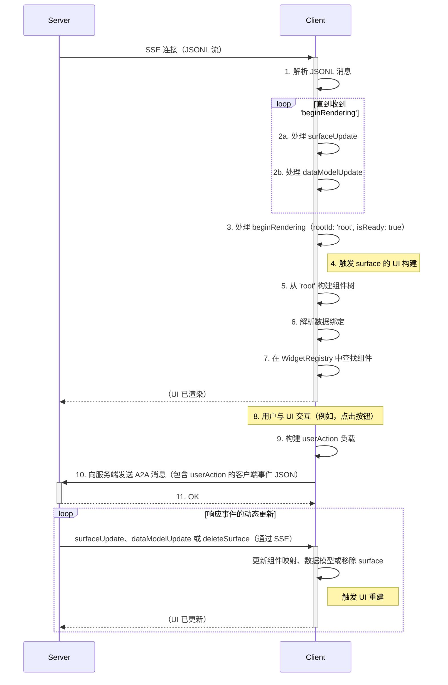
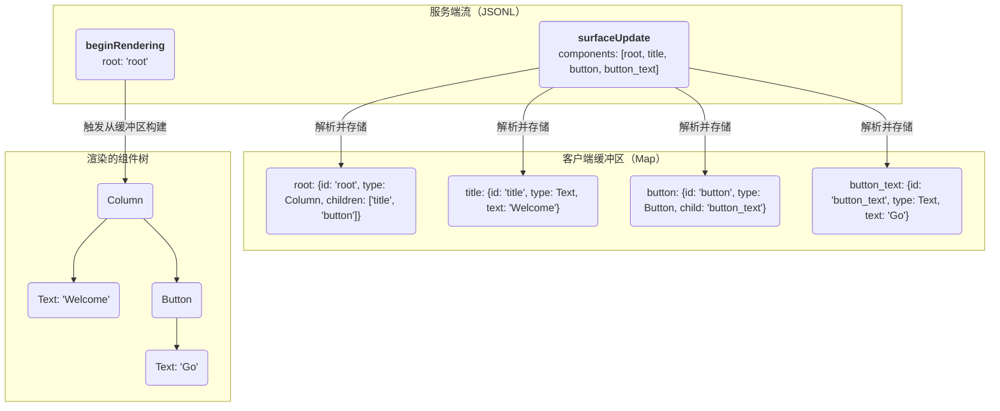

<!-- markdownlint-disable MD041 -->
<!-- markdownlint-disable MD033 -->
<div style="text-align: center;">
  <div class="centered-logo-text-group">
    
    <h1>A2UI (Agent to UI) 协议</h1>
  </div>
</div>

基于 JSONL 的流式 UI 协议规范

创建日期：2025年9月19日
更新日期：2025年11月12日

## 设计需求

A2UI（Agent to UI）协议应该是一个系统，其中 LLM 可以将平台无关的抽象 UI 定义流式传输到客户端，然后客户端使用原生组件集进行渐进式渲染。每个主要设计选择都可以追溯到 LLM 生成、感知性能和平台独立性的核心挑战。

### 需求：协议必须易于由 Transformer 大语言模型（LLM）生成

这是最关键的驱动因素。此需求直接导致了以下设计选择：

声明式、简单结构：协议应使用简单直接的声明式格式（"这是一个包含这些子元素的列"），而不是命令式格式（"现在，添加一个列；然后，向其中追加一个文本组件"）。LLM 擅长生成结构化的声明式数据。

扁平组件列表（邻接表）：要求 LLM 在单次过程中生成完美嵌套的 JSON 树是困难且容易出错的。一个扁平的组件列表，其中关系通过简单的字符串 ID 定义，更容易逐个生成。模型可以"想到"一个组件，给它一个 ID，然后稍后引用该 ID，而无需担心树的深度或对象嵌套。

无状态消息：每条 JSONL 消息都是一个自包含的信息单元（componentUpdate、dataModelUpdate）。这对于流式 LLM 来说是理想的，因为它可以在处理请求时增量输出这些消息。

### 需求：UI 必须渐进式渲染以实现快速、响应式的用户体验

系统必须让用户感觉快速，即使完整的 UI 很复杂且需要时间来生成。

通过 JSONL/SSE 流式传输：这是直接的解决方案。客户端不必等待一个庞大的 JSON 负载。它可以立即开始接收和处理 UI 组件，从而提高感知性能。

### 需求：协议必须与平台无关

相同的服务端逻辑应该能够在 Flutter 应用、Web 浏览器或潜在的其他平台上渲染 UI，而无需修改。

客户端定义的组件目录：这是平台无关设计的核心。协议应定义一个抽象的组件树（例如，"我需要一个包含 Row 的 Card"）。客户端负责将这些抽象类型映射到其原生组件实现（Flutter Card 组件、带有 card 样式的 HTML `<div>` 等）。服务端只需知道客户端支持的组件名称。

### 需求：状态管理必须高效且与 UI 结构解耦

更改 UI 中的一段文本不应需要重新发送整个 UI 定义。

数据与组件分离：拥有独立的 componentUpdate 和数据模型更新消息是关键。UI 结构只需发送一次，后续更新可以是仅包含变更数据的小型 dataModelUpdate 消息。

### 需求：通信架构必须健壮且可扩展

系统需要一种清晰、可靠的方式来处理服务端推送的 UI 和客户端发起的事件。

单向 UI 流：使用单向流（SSE）进行 UI 更新简化了客户端的逻辑。它只需要监听和响应。与尝试管理复杂的双向通道相比，这是一种更健壮的服务端推送模式。

事件处理：事件处理通过客户端向服务端代理发送 A2A 消息来完成

## 简介

A2UI 协议是一个设计用于从服务端发送的 JSON 对象流渲染用户界面的协议。其核心理念强调 UI 结构和应用数据的清晰分离，使客户端在处理每条消息时能够进行渐进式渲染。

该协议被设计为"LLM 友好"的，这意味着其结构是声明式且简单直接的，使生成模型易于产出。A2UI 的一个核心特征是其可扩展的组件模型。可用的 UI 组件集不是由协议固定的，而是在单独的 **Catalog** 中定义的，允许平台特定或自定义组件。

通信通过 JSON Lines（JSONL）流进行。客户端将每一行解析为一条独立的消息，并增量构建 UI。服务端到客户端的协议定义了四种消息类型：

- `surfaceUpdate`：提供要添加到或更新到称为"surface"的特定 UI 区域的组件定义列表。
- `dataModelUpdate`：提供要插入或替换 surface 数据模型的新数据。每个 surface 有自己的数据模型。
- `beginRendering`：向客户端发出信号，表示它已有足够信息执行初始渲染，指定根组件的 ID，以及可选的要使用的组件目录。
- `deleteSurface`：显式地从 UI 中移除一个 surface 及其内容。

客户端到服务端的用户交互通信通过 A2A 消息单独处理。此消息可以是以下两种类型之一：

- `userAction`：报告来自组件的用户发起的操作。
- `error`：报告客户端错误。
  这使主数据流保持单向。

## 第1节：基础架构和数据流

本文档规定了 A2UI 协议的架构和数据格式。设计遵循关注点严格分离、版本控制和渐进式渲染的原则。

### 1.1. 核心理念：解耦与契约

A2UI 的核心理念是三个关键元素的解耦：

1.  **组件树（结构）**：由服务端提供的抽象组件树，描述 UI 的结构。由 `surfaceUpdate` 消息定义。
2.  **数据模型（状态）**：由服务端提供的 JSON 对象，包含填充 UI 的动态值，如文本、布尔值或列表。通过 `dataModelUpdate` 消息管理。
3.  **组件注册表（"Catalog"）**：由客户端定义的组件类型（如 "Row"、"Text"）到具体原生组件实现的映射。此注册表是 **客户端应用程序的一部分**，而非协议流中的内容。服务端必须生成目标客户端注册表能理解的组件。

### 1.2. JSONL 流：通信单元

所有 UI 描述都以 JSON 对象流的形式从服务端传输到客户端，格式为 JSON Lines（JSONL）。每行是一个独立的紧凑 JSON 对象，代表一条消息。这允许客户端在 UI 定义的各部分到达时立即解析和处理，实现渐进式渲染。

### 1.3. Surface：管理多个 UI 区域

**Surface** 是屏幕上可以渲染 A2UI UI 的连续区域。协议引入了 `surfaceId` 的概念来唯一标识和管理这些区域。这允许单个 A2UI 流同时控制多个独立的 UI 区域。每个 surface 有独立的根组件和独立的组件层次结构。每个 surface 有独立的数据模型，以避免在使用大量 surface 时键名冲突。

例如，在聊天应用中，每个 AI 生成的回复可以渲染到对话历史中的单独 surface 中。一个独立的持久 surface 可用于显示相关信息的侧边面板。

`surfaceId` 是每条服务端到客户端消息中的一个属性，用于将更改定向到正确的区域。它与 `beginRendering`、`surfaceUpdate`、`dataModelUpdate` 和 `deleteSurface` 等消息一起使用，以定位特定的 surface。

### 1.4. 数据流模型

A2UI 协议由描述 UI 的服务端到客户端流和发送到服务端的独立事件组成。客户端消费流、构建 UI 并渲染。通信通过 JSON Lines（JSONL）流进行，通常通过 **Server-Sent Events（SSE）** 传输。

1.  **服务端流**：服务端通过 SSE 连接开始发送 JSONL 流。
2.  **客户端缓冲**：客户端接收消息并缓冲它们：

    - `surfaceUpdate`：组件定义存储在 `Map<String, Component>` 中，按 `surfaceId` 组织。如果 surface 不存在，则创建它。
    - `dataModelUpdate`：客户端内部的 JSON 数据模型被构建或更新。

3.  **渲染信号**：服务端发送带有 `root` 组件 ID 的 `beginRendering` 消息。这防止了"不完整内容闪烁"。客户端缓冲传入的组件和数据，但等待此显式信号后再尝试首次渲染，确保初始视图是连贯的。
4.  **客户端渲染**：客户端现在处于"就绪"状态，从 `root` 组件开始。它通过在缓冲区中查找组件 ID 来递归遍历组件树。它根据数据模型解析所有数据绑定，并使用其 `WidgetRegistry` 实例化原生组件。
5.  **用户交互和事件处理**：用户与渲染的组件交互（例如，点击按钮）。客户端构建 `userAction` JSON 负载，从组件的 `action.context` 中解析所有数据绑定。它通过 A2A 消息将此负载发送到服务端。
6.  **动态更新**：服务端处理 `userAction`。如果 UI 需要因此改变，服务端通过原始 SSE 流发送新的 `surfaceUpdate` 和 `dataModelUpdate` 消息。随着这些消息到达，客户端更新其组件缓冲区和数据模型，UI 重新渲染以反映更改。服务端也可以发送 `deleteSurface` 来移除 UI 区域。



### 1.5. 完整流示例

以下是一个完整的、最小化的 JSONL 流示例，渲染一个用户资料卡片。

```jsonl
{"surfaceUpdate": {"components": [{"id": "root", "component": {"Column": {"children": {"explicitList": ["profile_card"]}}}}]}}
{"surfaceUpdate": {"components": [{"id": "profile_card", "component": {"Card": {"child": "card_content"}}}]}}
{"surfaceUpdate": {"components": [{"id": "card_content", "component": {"Column": {"children": {"explicitList": ["header_row", "bio_text"]}}}}]}}
{"surfaceUpdate": {"components": [{"id": "header_row", "component": {"Row": {"alignment": "center", "children": {"explicitList": ["avatar", "name_column"]}}}}]}}
{"surfaceUpdate": {"components": [{"id": "avatar", "component": {"Image": {"url": {"literalString": "https://www.example.com/profile.jpg"}}}}]}}
{"surfaceUpdate": {"components": [{"id": "name_column", "component": {"Column": {"alignment": "start", "children": {"explicitList": ["name_text", "handle_text"]}}}}]}}
{"surfaceUpdate": {"components": [{"id": "name_text", "component": {"Text": {"usageHint": "h3", "text": {"literalString": "A2A Fan"}}}}]}}
{"surfaceUpdate": {"components": [{"id": "handle_text", "component": {"Text": {"text": {"literalString": "@a2a_fan"}}}}]}}
{"surfaceUpdate": {"components": [{"id": "bio_text", "component": {"Text": {"text": {"literalString": "Building beautiful apps from a single codebase."}}}}]}}
{"dataModelUpdate": {"contents": {}}}
{"beginRendering": {"root": "root"}}
```

## 第2节：组件模型

A2UI 的组件模型设计注重灵活性，将协议与组件集分离。

### 2.1. Catalog 协商

**Catalog** 定义了服务端和客户端之间关于可渲染 UI 的契约。它包含支持的组件类型列表（如 `Row`、`Text`）、其属性和可用样式。Catalog 由 **Catalog Definition Document** 定义。

每个 A2UI 协议版本都关联一个 **Standard Catalog**。对于 v0.8，其标识符为 `https://a2ui.org/specification/v0_8/standard_catalog_definition.json`。

Catalog ID 是简单的字符串标识符。虽然可以是任何内容，但惯例是使用您拥有的域名内的 URI，以简化调试、避免混淆和避免名称冲突。此外，如果对 catalog 进行了可能破坏代理和渲染器之间兼容性的更改，则**必须**分配新的 `catalogId`。这确保了清晰的版本控制，并防止在代理有更改而客户端没有（或反之）时出现意外行为。

协商过程允许客户端和服务端就给定 UI surface 使用哪个 catalog 达成一致。此过程设计灵活，支持标准、自定义甚至动态定义的 catalog。

流程如下：

#### 1. 服务端通告能力

服务端（代理）在 A2A 协议的 Agent Card 中通告其能力。对于 A2UI，这包括它支持哪些 catalog 以及是否能处理客户端内联定义的 catalog。

- `supportedCatalogIds`（字符串数组，可选）：代理已知支持的所有预定义 catalog 的 ID 列表。
- `acceptsInlineCatalogs`（布尔值，可选）：如果为 `true`，服务端可以处理客户端发送的 `inlineCatalogs`。默认为 `false`。

**服务端 Agent Card 片段示例：**
```json
{
  "name": "Restaurant Finder",
  "capabilities": {
    "extensions": [
      {
        "uri": "https://a2ui.org/a2a-extension/a2ui/v0.8",
        "params": {
          "supportedCatalogIds": [
            "https://a2ui.org/specification/v0_8/standard_catalog_definition.json",
            "https://my-company.com/a2ui/v0.8/my_custom_catalog.json"
          ],
          "acceptsInlineCatalogs": true
        }
      }
    ]
  }
}
```

请注意，这不是严格的契约，纯粹作为帮助编排器和客户端识别具有匹配 UI 能力的代理的信号。在运行时，编排代理可能会动态地将任务委托给支持编排代理未通告的额外 catalog 的子代理。因此，客户端应将通告的 supportedCatalogIds 视为代理或其子代理可能支持的真正 catalog 的子集。

#### 2. 客户端声明支持的 Catalog

在发送到服务端的**每条**消息中，客户端在 A2A `Message` 的 metadata 中包含一个 `a2uiClientCapabilities` 对象。此对象告知代理服务器客户端可以渲染的所有 catalog。

- `supportedCatalogIds`（字符串数组，必需）：客户端支持的所有预定义 catalog 的标识符列表。如果客户端支持标准 catalog，则**必须**在此处显式包含标准 catalog ID。这些 catalog 的内容预期被编译到代理服务器中，而非在运行时下载，以防止恶意内容被动态注入到提示中，并确保可预测的结果。
- `inlineCatalogs`（对象数组，可选）：完整的 Catalog Definition Document 数组。这允许客户端提供自定义的、即时的 catalog，通常用于本地开发工作流中，在客户端一处更新 catalog 更快。仅当服务端通告了 `acceptsInlineCatalogs: true` 时才可提供此项。

**包含客户端能力的 A2A 消息示例：**
```json
{
  "metadata": {
    "a2uiClientCapabilities": {
      "supportedCatalogIds": [
        "https://a2ui.org/specification/v0_8/standard_catalog_definition.json",
        "https://my-company.com/a2ui_catalogs/custom-reporting-catalog-1.2"
      ],
      "inlineCatalogs": [
        {
          "catalogId": "https://my-company.com/inline_catalogs/temp-signature-pad-catalog",
          "components": {
            "SignaturePad": {
              "type": "object",
              "properties": { "penColor": { "type": "string" } }
            }
          },
          "styles": {}
        }
      ]
    }
  },
  "message": {
    "prompt": {
      "text": "Find me a good restaurant"
    }
  }
}
```

#### 3. 服务端选择 Catalog 并渲染

服务端接收客户端的能力并为特定的 UI surface 选择要使用的 catalog。服务端在 `beginRendering` 消息中使用 `catalogId` 字段指定其选择。

- `catalogId`（字符串，可选）：所选 catalog 的标识符。此 ID 必须是 `supportedCatalogIds` 之一或客户端提供的 `inlineCatalogs` 中某个 catalog 的 `catalogId`。

如果省略 `catalogId`，客户端**必须**默认使用协议版本的标准 catalog（`https://a2ui.org/specification/v0_8/standard_catalog_definition.json`）。

**`beginRendering` 消息示例：**
```json
{
  "beginRendering": {
    "surfaceId": "unique-surface-1",
    "catalogId": "https://my-company.com/inline_catalogs/temp-signature-pad-catalog",
    "root": "root-component-id"
  }
}
```

每个 surface 可以使用不同的 catalog，提供了高度的灵活性，特别是在不同代理可能支持不同 catalog 的多代理系统中。

#### 开发者 Schema

在构建代理时，建议使用包含您目标组件 catalog 的已解析 schema（例如，将 `server_to_client.json` 与您的 `https://my-company.com/a2ui_catalogs/custom-reporting-catalog-1.2` 定义组合的自定义 schema）。这为 LLM 提供了所有可用组件及其属性以及 catalog 特定样式的严格定义，从而产生更可靠的 UI 生成。通用的 `server_to_client.json` 是抽象的线路协议，而已解析的 schema 是生成的具体工具。

为了基于标准 `server_to_client_schema` 和 `custom_catalog_definition` 对象进行替换，您可以使用类似以下的 JSON 操作逻辑：

```py
component_properties = custom_catalog_definition["components"]
style_properties = custom_catalog_definition["styles"]
resolved_schema = copy.deepcopy(server_to_client_schema)

resolved_schema["properties"]["surfaceUpdate"]["properties"]["components"]["items"]["properties"]["component"]["properties"] = component_properties
resolved_schema["properties"]["beginRendering"]["properties"]["styles"]["properties"] = style_properties
```

参见 `server_to_client_with_standard_catalog.json`，了解已替换组件的已解析 schema 示例。

### 2.2. `surfaceUpdate` 消息

此消息是定义 UI 结构的主要方式。它包含一个 `surfaceId` 和一个 `components` 数组。

```json
{
  "surfaceUpdate": {
    "surfaceId": "main_content_area",
    "components": [
      {
        "id": "unique-component-id",
        "component": {
          "Text": {
            "text": { "literalString": "Hello, World!" }
          }
        }
      },
      {
        "id": "another-component-id",
        "component": { ... }
      }
    ]
  }
}
```

- `components`：必需的组件实例扁平列表。

### 2.3. 组件对象

`components` 数组中的每个对象具有以下结构：

- `id`：必需的唯一字符串，标识此特定组件实例。用于父子引用。
- `component`：必需的对象，定义组件的类型和属性。

### 2.4.`component`（通用对象）

在传输层，此对象是通用的。其结构不由核心 A2UI 协议定义。相反，其验证基于活动的 **Catalog**。它是一个包装对象，**必须**恰好包含一个键，其中键是 catalog 中组件类型的字符串名称（如 `"Text"`、`"Row"`）。值是包含该组件属性的对象，如 catalog 中所定义。

**示例：** 一个 `Text` 组件：

```json
"component": {
  "Text": {
    "text": { "literalString": "This is text" }
  }
}
```

一个 `Button` 组件：

```json
"component": {
  "Button": {
    "label": { "literalString": "Click Me" },
    "action": { "name": "submit_form" }
  }
}
```

可用组件类型及其属性的完整集合由 **Catalog Schema** 定义，而非核心协议 schema。

## 第3节：UI 组合

### 3.1. 邻接表模型

A2UI 协议将 UI 定义为组件的扁平列表。树结构使用 ID 引用隐式构建。这被称为邻接表模型。

容器组件（如 `Row`、`Column`、`List`、`Card`）具有引用其子组件 `id` 的属性。客户端负责将所有组件存储在映射中（如 `Map<String, Component>`），并在渲染时重建树结构。

此模型允许服务端以任意顺序发送组件定义，只要在发送 `beginRendering` 时所有必要的组件都已存在。



### 3.2. 容器子元素：`explicitList` 与 `template`

容器组件（`Row`、`Column`、`List`）使用 `children` 对象定义其子元素，该对象必须包含 `explicitList` 或 `template` 中的_恰好一个_。

- `explicitList`：组件 `id` 字符串数组。用于静态的、已知的子元素。
- `template`：用于从数据绑定列表渲染动态子元素列表的对象。

```json
{
  "type": "object",
  "description": "定义容器组件的子元素。必须恰好包含 `explicitList` 或 `template` 中的一个。",
  "properties": {
    "explicitList": {
      "type": "array",
      "description": "作为直接子元素的组件 ID 有序列表。",
      "items": {
        "type": "string",
        "description": "子组件的 ID。"
      }
    },
    "template": {
      "type": "object",
      "description": "定义用于渲染动态子元素列表的模板。",
      "properties": {
        "dataBinding": { "$ref": "#/definitions/DataPath" },
        "componentId": {
          "type": "string",
          "description": "用作数据绑定列表中每项模板的组件 ID。"
        }
      },
      "required": ["dataBinding", "componentId"],
      "additionalProperties": false
    }
  },
  "minProperties": 1,
  "maxProperties": 1
}
```

### 3.3. 使用 `template` 进行动态列表渲染

要渲染动态列表，容器使用 `template` 属性。

1.  `dataBinding`：指向数据模型中列表的路径（如 `/user/posts`）。
2.  `componentId`：缓冲区中另一个组件的 `id`，用作列表中每项的模板。

客户端将遍历 `dataBinding` 处的列表，对每个项渲染由 `componentId` 指定的组件。该项的数据可供模板组件用于相对数据绑定。

## 第4节：动态数据与状态管理

A2UI 强制 UI 结构（组件）与动态数据（数据模型）之间的清晰分离。

### 4.1. `dataModelUpdate` 消息

此消息是修改客户端数据模型的唯一方式。

- `surfaceId`：此数据模型更新适用的 UI surface 的唯一标识符。
- `path`：数据模型中某个位置的可选路径（如 '/user/name'）。如果省略，更新将应用于数据模型的根。
- `contents`：以邻接表形式排列的数据条目数组。每个条目必须包含一个 'key' 和恰好一个对应的类型化 'value\*' 属性（如 `valueString`、`valueNumber`、`valueBoolean`、`valueMap`）。
  - `valueMap`：以邻接表表示映射的 JSON 对象。

#### 示例：更新数据模型

```json
{
  "dataModelUpdate": {
    "surfaceId": "main_content_area",
    "path": "user",
    "contents": [
      { "key": "name", "valueString": "Bob" },
      { "key": "isVerified", "valueBoolean": true },
      {
        "key": "address",
        "valueMap": [
          { "key": "street", "valueString": "123 Main St" },
          { "key": "city", "valueString": "Anytown" }
        ]
      }
    ]
  }
}
```

### 4.2. 数据绑定（`BoundValue` 对象）

组件通过绑定连接到数据模型。任何可以数据绑定的属性（如 `Text` 组件的 `text`）接受一个 `BoundValue` 对象。此对象定义字面值、数据路径，或两者兼有作为初始化简写。

从 catalog schema 来看，一个绑定的 `text` 属性如下所示：

```json
{
  "type": "object",
  "description": "一个可以是字面字符串或绑定到数据模型的值。",
  "properties": {
    "literalString": {
      "type": "string",
      "description": "静态字符串值。"
    },
    "path": { "$ref": "#/definitions/DataPath" }
  },
  "minProperties": 1,
  "additionalProperties": false
}
```

组件还可以绑定到数字（`literalNumber`）、布尔值（`literalBoolean`）或数组（`literalArray`）。行为取决于提供了哪些属性：

- **仅字面值**：如果仅提供 `literal*` 值（如 `literalString`），则该值是静态的并直接显示。

  ```json
  "text": { "literalString": "Hello" }
  ```

- **仅路径**：如果仅提供 `path`，则该值是动态的。它在渲染时从数据模型中解析。

  ```json
  "text": { "path": "/user/name" }
  ```

- **路径和字面值（初始化简写）**：如果**同时**提供了 `path` 和 `literal*` 值，它作为数据模型初始化的简写。客户端必须：

  1.  使用提供的 `literal*` 值更新指定 `path` 处的数据模型。这是一个隐式的 `dataModelUpdate`。
  2.  将组件属性绑定到该 `path` 以进行渲染和后续更新。

  这允许服务端在单步中设置默认值并绑定到它。

  ```json
  // 这将 '/user/name' 处的数据模型初始化为 "Guest" 并绑定到它。
  "text": { "path": "/user/name", "literalString": "Guest" }
  ```

客户端的解释器负责在渲染前根据数据模型解析这些路径。A2UI 协议支持直接的 1:1 绑定；它不包含转换器（如格式化器、条件判断）。任何数据转换必须由服务端在通过 `dataModelUpdate` 发送之前完成。

## 第5节：事件处理

虽然服务端到客户端的 UI 定义是单向流（如通过 SSE），但用户交互通过 A2A 消息回传到服务端。

### 5.1. 客户端事件消息

客户端发送一个充当包装器的 JSON 对象。它必须恰好包含以下键之一：`userAction` 或 `error`。

### 5.2. `userAction` 消息

当用户与定义了操作的组件交互时发送此消息。它是用户驱动事件的主要机制。

`userAction` 对象具有以下结构：

- `name`（字符串，必需）：操作的名称，直接取自组件的 `action.name` 属性（如 "submit_form"）。
- `surfaceId`（字符串，必需）：事件来源的 surface 的 `id`。
- `sourceComponentId`（字符串，必需）：触发事件的组件的 `id`（如 "my_button"）。
- `timestamp`（字符串，必需）：事件发生时的 ISO 8601 时间戳（如 "2025-09-19T17:01:00Z"）。
- `context`（对象，必需）：包含组件 `action.context` 中键值对的 JSON 对象，在根据数据模型解析所有 `BoundValue` 之后。

解析 `action.context` 的过程保持不变：客户端遍历 `context` 数组，解析所有字面值或数据绑定值，并构建 `context` 对象。

### 5.3. `error` 消息

此消息为服务端提供反馈机制。当客户端遇到错误时发送，例如在 UI 渲染或数据绑定期间。对象的内容是灵活的，可以包含任何相关的错误信息。

### 5.4. 事件流程示例（`userAction`）

1.  **组件定义**（来自 `surfaceUpdate`）：

    ```json
    {
      "surfaceUpdate": {
        "surfaceId": "main_content_area",
        "components": [
          {
            "id": "submit_btn_text",
            "component": {
              "Text": {
                "text": { "literalString": "Submit" }
              }
            }
          },
          {
            "id": "submit_btn",
            "component": {
              "Button": {
                "child": "submit_btn_text",
                "action": {
                  "name": "submit_form",
                  "context": [
                    {
                      "key": "userInput",
                      "value": { "path": "/form/textField" }
                    },
                    { "key": "formId", "value": { "literalString": "f-123" } }
                  ]
                }
              }
            }
          }
        ]
      }
    }
    ```

2.  **数据模型**（来自 `dataModelUpdate`）：

    ```json
    {
      "dataModelUpdate": {
        "surfaceId": "main_content_area",
        "path": "form",
        "contents": [{ "key": "textField", "valueString": "User input text" }]
      }
    }
    ```

3.  **用户操作**：用户点击 "submit_btn" 按钮。
4.  **客户端解析**：客户端解析 `action.context`。
5.  **客户端到服务端请求**：客户端向 `https://api.example.com/handle_event` 发送 `POST` 请求，JSON 请求体如下：

    ```json
    {
      "userAction": {
        "name": "submit_form",
        "surfaceId": "main_content_area",
        "sourceComponentId": "submit_btn",
        "timestamp": "2025-09-19T17:05:00Z",
        "context": {
          "userInput": "User input text",
          "formId": "f-123"
        }
      }
    }
    ```

6.  **服务端响应**：服务端处理此事件。如果 UI 需要因此改变，服务端通过**独立的 SSE 流**发送新的 `surfaceUpdate` 或 `dataModelUpdate` 消息。

## 第6节：客户端实现

一个健壮的 A2UI 客户端解释器应由以下关键组件组成：

- **JSONL 解析器**：能够逐行读取流并将每行解码为独立 JSON 对象的解析器。
- **消息分发器**：一种机制（如 `switch` 语句），用于识别消息类型（`beginRendering`、`surfaceUpdate` 等）并将其路由到正确的处理程序。
- **组件缓冲区**：一个 `Map<String, Component>`，按 `id` 存储所有组件实例。由 `componentUpdate` 消息填充。
- **数据模型存储**：一个 `Map<String, dynamic>`（或类似结构），保存应用状态。由 `dataModelUpdate` 消息构建和修改。
- **解释器状态**：一个状态机，用于跟踪客户端是否准备好渲染（如由 `beginRendering` 设置为 `true` 的 `_isReadyToRender` 布尔值）。
- **组件注册表**：开发者提供的映射（如 `Map<String, WidgetBuilder>`），将组件类型字符串（"Row"、"Text"）与构建原生组件的函数关联。
- **绑定解析器**：一个工具，可以接收 `BoundValue`（如 `{ "path": "/user/name" }`）并根据数据模型存储进行解析。
- **Surface 管理器**：基于 `surfaceId` 创建、更新和删除 UI surface 的逻辑。
- **事件处理程序**：一个暴露给 `WidgetRegistry` 的函数，用于构建客户端事件消息（如 `userAction`）并将其发送到配置的 REST API 端点。

## 第7节：完整的 A2UI 服务端到客户端 JSON Schema

本节提供 A2UI JSONL 流中单条服务端到客户端消息的正式 JSON Schema。流中的每行必须是一个符合此 schema 的有效 JSON 对象。它包含整个基础组件 catalog，但这些组件可以替换为客户端支持的其他组件。它经过优化，能够以各种 LLM 的结构化输出模式生成。

```json

```

## 第8节：完整的 A2UI 客户端到服务端 JSON Schema

本节提供 A2UI 协议中单条客户端到服务端消息的正式 JSON Schema。

```json

```
