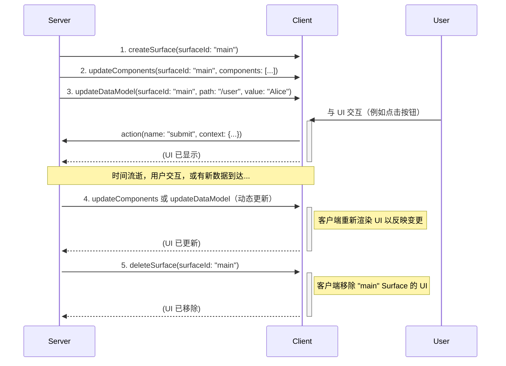
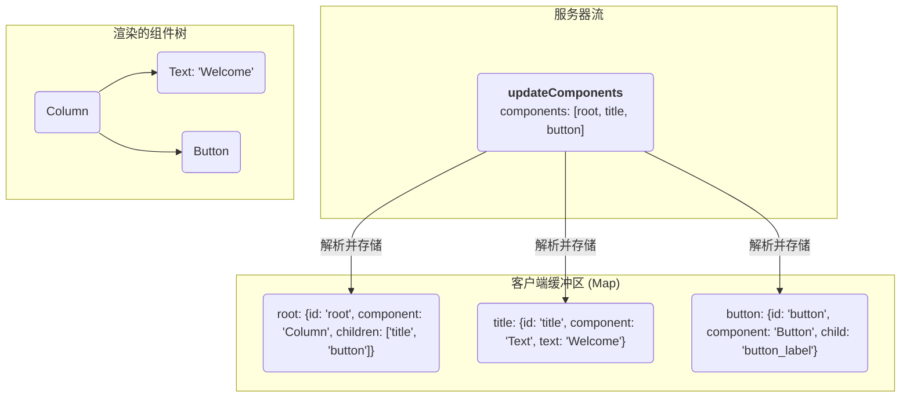

<!-- markdownlint-disable MD041 -->
<!-- markdownlint-disable MD033 -->
<!-- markdownlint-disable MD034 -->
<div style="text-align: center;">
  <div class="centered-logo-text-group">
    
    <h1>A2UI (Agent to UI) 协议 v0.9</h1>
  </div>
</div>

基于 JSON 的流式 UI 协议规范。

**版本：** 0.9
**状态：** 草案
**创建日期：** 2025年11月20日
**最后更新：** 2025年12月3日

基于 JSON 的流式 UI 协议规范

## 简介

A2UI 协议旨在通过从服务器（Agent）发送的 JSON 对象流来动态渲染用户界面。其核心理念强调 UI 结构与应用数据的清晰分离，使客户端在处理每条消息时能够进行渐进式渲染。

通信通过 JSON 对象流进行。客户端将每个对象解析为独立的消息，并逐步构建或更新 UI。服务器到客户端的协议定义了四种消息类型：

- `createSurface`：通知客户端创建一个新的 Surface 并开始渲染。
- `updateComponents`：提供要添加到或更新特定 Surface 中的组件定义列表。
- `updateDataModel`：提供要插入或替换 Surface 数据模型的新数据。
- `deleteSurface`：显式地从 UI 中移除一个 Surface 及其内容。

## 与先前版本的变更

A2UI 协议的 0.9 版本代表了与先前版本的理念转变。v0.8 针对支持结构化输出的 LLM 进行了优化，而 v0.9 则设计为直接嵌入到模型的提示中。然后要求 LLM 生成与提供的示例和模式描述匹配的 JSON。

这种"提示优先"的方法具有以下优势：

1. **更丰富的模式：** 协议不再受结构化输出格式约束的限制。这允许更可读、更复杂、更具表现力的组件目录。
2. **模块化：** 模式现在被重构为独立的、更易于管理的组件（例如 [`common_types.json`]、[`basic_catalog.json`]、[`server_to_client.json`]），提高了可维护性和模块化程度。

这种方法的主要缺点是它需要更复杂的生成后验证，因为 LLM 不受模式的严格约束。这需要健壮的错误处理和纠正机制，以便系统能够识别差异并在渲染前尝试修复，或者请求 LLM 重试或纠正。

有关 v0.8 和 v0.9 之间差异的详细说明，请参阅[演进指南](evolution_guide.md)。

## 协议概述与数据流

A2UI 协议使用从服务器到客户端的 JSON 消息单向流来描述和更新 UI。客户端消费此流，构建 UI 并渲染它。用户交互通过单独处理，通常通过向不同的端点发送事件，这可能会在 UI 流上触发新消息。

以下是一个事件序列示例（不必完全按照此顺序）：

1. **创建 Surface：** 服务器发送 `createSurface` 消息来初始化 Surface。
2. **更新 Surface：** 一旦 Surface 被创建，服务器发送一个或多个 `updateComponents` 消息，包含将成为 Surface 一部分的所有组件的定义。
3. **更新数据模型：** 一旦 Surface 被创建，服务器可以随时发送 `updateDataModel` 消息来填充或更改 UI 组件将显示的数据。
4. **渲染：** 客户端渲染 Surface 的 UI，使用组件定义构建结构，使用数据模型填充内容。
5. **动态更新：** 随着用户与应用交互或有新信息可用，服务器可以发送额外的 `updateComponents` 和 `updateDataModel` 消息来动态更改 UI。
6. **删除 Surface：** 当不再需要某个 UI 区域时，服务器发送 `deleteSurface` 消息来移除它。



## 传输解耦

A2UI 协议设计为传输无关的。它定义了 JSON 消息结构以及服务器（Agent）和客户端（渲染器）之间的语义契约，但不强制要求特定的传输层。

### 传输契约

要支持 A2UI，传输层必须满足以下契约：

1. **可靠交付：** 消息必须按生成的顺序交付。A2UI 依赖于有状态更新（例如，在更新之前创建 Surface），因此乱序交付可能会破坏 UI 状态。
2. **消息分帧：** 传输必须清晰界定单个 JSON 信封消息的边界（例如，在 JSONL 中使用换行符、WebSocket 帧或 SSE 事件）。
3. **元数据支持：** 传输必须提供将元数据与消息关联的机制。这对于以下功能至关重要：
   - **数据模型同步：** `sendDataModel` 功能要求客户端将当前数据模型状态作为元数据与用户操作一起发送。
   - **能力交换：** 客户端能力（支持的目录、自定义组件）和服务器能力通过元数据或传输特定的握手（如 A2A 中的 Agent Card 或 MCP 中的初始化）进行交换。
4. **双向能力（可选）：** 虽然渲染流是单向的（服务器 -> 客户端），但交互式应用需要 `action` 消息的返回通道（客户端 -> 服务器）。

### 传输绑定

虽然 A2UI 是传输无关的，但它最常与以下传输一起使用。

#### A2A (Agent2Agent) 绑定

[A2A (Agent-to-Agent)](https://a2a-protocol.org/latest/) 是智能体系统中 A2UI 的优秀传输选项，通过额外的负载扩展了 A2A。
A2A 具有处理远程 Agent 通信的独特能力，还可以在智能体后端和前端应用之间提供安全高效的传输。

- **消息映射：** 每个 A2UI 信封（例如 `updateComponents`）对应单个 A2A 消息 Part 的负载。
- **元数据：**
  - **数据模型：** 当 `sendDataModel` 激活时，客户端的 `a2uiClientDataModel` 对象放置在 A2A 消息的 `metadata` 字段中。
  - **能力：** `a2uiClientCapabilities` 对象放置在从客户端发送到服务器的每条 A2A 消息的 `metadata` 字段中。
- **上下文：** A2UI 会话通常映射到 A2A 的 `contextId`。一组相关 Surface 的所有消息应共享相同的 `contextId`。

#### AG UI (Agent to User Interface) 绑定

**[AG-UI](https://docs.ag-ui.com/introduction)** 也是 A2UI Agent-用户交互协议的优秀传输选项。
AG UI 提供与许多 Agent 框架和前端的便捷集成。AG UI 在前端和智能体后端之间提供低延迟和共享状态的消息传递。

#### 其他传输

A2UI 还可以通过以下方式传输：

- **[MCP (Model Context Protocol)](https://modelcontextprotocol.io/docs/getting-started/intro)**：作为工具输出或资源订阅交付。
- **[SSE](https://en.wikipedia.org/wiki/Server-sent_events) + [JSON RPC](https://www.jsonrpc.org/)**：用于支持流式传输的 Web 集成的标准服务器推送事件，以及用于客户端-服务器通信的 JSON RPC。
- **[WebSockets](https://en.wikipedia.org/wiki/WebSocket)**：用于双向实时会话。
- **[REST](https://cloud.google.com/discover/what-is-rest-api?hl=en)**：对于简单用例，REST API 可以工作，但缺乏流式传输能力。

## 协议模式

A2UI v0.9 由三个相互作用的 JSON 模式定义。

### 通用类型

[`common_types.json`] 模式定义了整个协议中使用的可复用原语。

- **`DynamicString` / `DynamicNumber` / `DynamicBoolean` / `DynamicStringList`**：数据绑定系统的核心。任何可以绑定到数据的属性都定义为 `Dynamic*` 类型。它接受字面值、`path` 字符串（[JSON Pointer]）或 `FunctionCall`（函数调用）。
- **`ChildList`**：定义容器如何持有子组件。它支持：
  - `array`：`ComponentId` 组件引用的静态数组。
  - `object`：从数据绑定列表生成子组件的模板（需要模板 `componentId` 和数据绑定 `path`）。

- **`ComponentId`**：对同一 Surface 内另一个组件唯一 ID 的引用。

### 服务器到客户端消息结构：信封

[`server_to_client.json`] 模式是顶层入口点。服务器流式传输的每条消息都必须根据此模式进行验证。它处理消息分发。

### 基础目录

[`basic_catalog.json`] 模式包含所有特定 UI 组件（例如 `Text`、`Button`、`Row`）、函数（例如 `required`、`email`）和主题模式的定义。

**可替换目录与验证：**

[`server_to_client.json`] 信封模式设计为目录无关的。它使用占位符文件名 `catalog.json` 引用组件和主题（具体为 `$ref: "catalog.json#/$defs/anyComponent"` 和 `$ref: "catalog.json#/$defs/theme"`）。

要验证 A2UI 消息：

1. **基础目录**：将 `catalog.json` 映射到 `basic_catalog.json`。
2. **自定义目录**：将 `catalog.json` 映射到您的自定义目录文件（例如 `my_custom_catalog.json`）。

这种间接引用允许相同的核心信封模式与任何合规的组件目录一起使用，而无需修改。

自定义目录可用于定义额外的 UI 组件或修改现有组件的行为。要使用自定义目录，只需在提示中用它替代基础目录即可。它应具有与基础目录相同的形式，并使用 [`common_types.json`] 模式中的通用元素。

### 验证器合规性与自定义目录

为确保自动验证器能够验证 UI 树的完整性（检查父组件是否引用了存在的子组件），自定义目录必须遵循以下严格的类型规则：

1. **单个子组件引用：** 任何持有另一个组件 ID 的属性必须使用 `common_types.json` 中定义的 `ComponentId` 类型。
   - 使用：`"$ref": "common_types.json#/$defs/ComponentId"`
   - 不要使用：`"type": "string"`

2. **列表引用：** 任何持有子组件列表或模板的属性必须使用 `ChildList` 类型。
   - 使用：`"$ref": "common_types.json#/$defs/ChildList"`

验证器通过查找这些特定的模式引用来确定哪些字段代表结构链接。如果您为 ID 使用原始字符串类型，验证器会将其视为静态文本（如 URL 或标签），而不会检查目标组件是否存在。

## 信封消息结构

信封定义了四种主要消息类型，服务器流式传输的每条消息必须是包含以下键之一的 JSON 对象：`createSurface`、`updateComponents`、`updateDataModel` 或 `deleteSurface`。该键指示消息类型，这些是组成协议流中每条消息的消息。

### `createSurface`

此消息通知客户端创建一个新的 Surface 并开始渲染。在向 Surface 发送任何 `updateComponents` 或 `updateDataModel` 消息之前，必须先创建该 Surface。虽然通常通过 Agent 发送 `createSurface` 消息来实现，但如果 Agent 知道 Surface 已被创建（例如由另一个 Agent 创建），则可以跳过此步骤。一旦 Surface 被创建，其 `surfaceId` 和 `catalogId` 即被固定；要重新配置它们，必须删除并重新创建 Surface。组件列表中的一个组件必须具有 `root` 的 `id`，作为组件树的根。

**属性：**

- `surfaceId`（字符串，必需）：要渲染的 UI Surface 的唯一标识符。
- `catalogId`（字符串，必需）：唯一标识此 Surface 使用的目录（组件和函数）的字符串。建议使用您拥有的互联网域名作为前缀，以避免冲突（例如 `https://mycompany.com/1.0/somecatalog`）。如果是 URL，该 URL 不需要部署任何资源，它只是一个唯一标识符。
- `theme`（对象，可选）：包含目录主题模式中定义的主题参数（例如 `primaryColor`）的 JSON 对象。
- `sendDataModel`（布尔值，可选）：如果为 true，客户端将在发送到服务器的每条消息的元数据中（通过传输的元数据机制）发送此 Surface 的完整数据模型。这确保 Surface 所有者与用户的操作或查询一起收到 UI 的完整当前状态。默认为 false。

**示例：**

```json
{
  "version": "v0.9",
  "createSurface": {
    "surfaceId": "user_profile_card",
    "catalogId": "https://a2ui.org/specification/v0_9/basic_catalog.json",
    "theme": {
      "primaryColor": "#00BFFF"
    },
    "sendDataModel": true
  }
}
```

### `updateComponents`

此消息提供要添加到或更新特定 Surface 中的 UI 组件列表。组件以扁平列表的形式提供，它们之间的关系由邻接表中的 ID 引用定义。此消息只能发送到已创建的 Surface。请注意，组件可能引用尚不存在的子组件或数据绑定；客户端应通过渲染占位符（渐进式渲染）来优雅地处理这种情况。

**属性：**

- `surfaceId`（字符串，必需）：要更新的 UI Surface 的唯一标识符。这通常是一个有意义的名称（例如 "user_profile_card"），并且在 GenUI 会话的上下文中必须是唯一的。
- `components`（数组，必需）：组件对象列表。组件以扁平列表的形式提供，它们之间的关系由邻接表中的 ID 引用定义。

**示例：**

```json
{
  "version": "v0.9",
  "updateComponents": {
    "surfaceId": "user_profile_card",
    "components": [
      {
        "id": "root",
        "component": "Column",
        "children": ["user_name", "user_title"]
      },
      {
        "id": "user_name",
        "component": "Text",
        "text": "John Doe"
      },
      {
        "id": "user_title",
        "component": "Text",
        "text": "Software Engineer"
      }
    ]
  }
}
```

### `updateDataModel`

此消息用于发送或更新填充 UI 组件的数据。它允许服务器在不重新发送整个组件结构的情况下更改 UI 的内容。`updateDataModel` 消息将指定 `path` 处的值替换为新内容。如果省略 `path`（或为 `/`），则替换 Surface 的整个数据模型。

**属性：**

- `surfaceId`（字符串，必需）：此数据模型更新所应用的 UI Surface 的唯一标识符。
- `path`（字符串，可选）：指向数据模型中要更新位置的 JSON Pointer。默认为 `/`。
- `value`（任意类型，可选）：指定路径的新值。如果省略，则移除 `path` 处的键。

**示例：**

```json
{
  "version": "v0.9",
  "updateDataModel": {
    "surfaceId": "user_profile_card",
    "path": "/user/name",
    "value": "Jane Doe"
  }
}
```

### `deleteSurface`

此消息指示客户端从 UI 中移除一个 Surface 及其所有关联的组件和数据。

**属性：**

- `surfaceId`（字符串，必需）：要删除的 UI Surface 的唯一标识符。

**示例：**

```json
{
  "version": "v0.9",
  "deleteSurface": {
    "surfaceId": "user_profile_card"
  }
}
```

## 示例流

以下示例演示了渲染联系表单的完整交互，以 JSONL 流的形式表示。

```jsonl
{"version": "v0.9", "createSurface":{"surfaceId":"contact_form_1","catalogId":"https://a2ui.org/specification/v0_9/basic_catalog.json"}}
{"version": "v0.9", "updateComponents":{"surfaceId":"contact_form_1","components":[{"id":"root","component":"Card","child":"form_container"},{"id":"form_container","component":"Column","children":["header_row","name_row","email_group","phone_group","pref_group","divider_1","newsletter_checkbox","submit_button"],"justify":"start","align":"stretch"},{"id":"header_row","component":"Row","children":["header_icon","header_text"],"align":"center"},{"id":"header_icon","component":"Icon","name":"mail"},{"id":"header_text","component":"Text","text":"# Contact Us","variant":"h2"},{"id":"name_row","component":"Row","children":["first_name_group","last_name_group"],"justify":"spaceBetween"},{"id":"first_name_group","component":"Column","children":["first_name_label","first_name_field"],"weight":1},{"id":"first_name_label","component":"Text","text":"First Name","variant":"caption"},{"id":"first_name_field","component":"TextField","label":"First Name","value":{"path":"/contact/firstName"},"variant":"shortText"},{"id":"last_name_group","component":"Column","children":["last_name_label","last_name_field"],"weight":1},{"id":"last_name_label","component":"Text","text":"Last Name","variant":"caption"},{"id":"last_name_field","component":"TextField","label":"Last Name","value":{"path":"/contact/lastName"},"variant":"shortText"},{"id":"email_group","component":"Column","children":["email_label","email_field"]},{"id":"email_label","component":"Text","text":"Email Address","variant":"caption"},{"id":"email_field","component":"TextField","label":"Email","value":{"path":"/contact/email"},"variant":"shortText","checks":[{"call":"required","args":{"value":{"path":"/contact/email"}},"message":"Email is required."},{"call":"email","args":{"value":{"path":"/contact/email"}},"message":"Please enter a valid email address."}]},{"id":"phone_group","component":"Column","children":["phone_label","phone_field"]},{"id":"phone_label","component":"Text","text":"Phone Number","variant":"caption"},{"id":"phone_field","component":"TextField","label":"Phone","value":{"path":"/contact/phone"},"variant":"shortText"},{"id":"pref_group","component":"Column","children":["pref_label","pref_picker"]},{"id":"pref_label","component":"Text","text":"Preferred Contact Method","variant":"caption"},{"id":"pref_picker","component":"ChoicePicker","value":{"path":"/contact/preference"},"variant":"multipleSelection","options":[{"id":"email_opt","label":"Email"},{"id":"phone_opt","label":"Phone"},{"id":"sms_opt","label":"SMS"}]},{"id":"divider_1","component":"Divider"},{"id":"newsletter_checkbox","component":"CheckBox","label":"Subscribe to newsletter","value":{"path":"/contact/subscribe"}},{"id":"submit_button","component":"Button","text":"Submit","variant":"primary","action":{"event":{"name":"submit_form","context":{"formData":{"path":"/contact"}}}}}],"justify":"start","align":"stretch"}]}}
{"version": "v0.9", "updateDataModel":{"surfaceId":"contact_form_1","path":"/contact","value":{"firstName":"John","lastName":"Doe","email":"john.doe@example.com","phone":"1234567890","preference":["email"],"subscribe":true}}}
{"version": "v0.9", "deleteSurface":{"surfaceId":"contact_form_1"}}
```

## 组件模型

A2UI 的组件模型设计灵活，将协议的结构与可用 UI 组件集分离。

### 组件对象

`updateComponents` 消息的 `components` 数组中的每个对象定义一个 UI 组件。它具有以下结构：

- `id`（`ComponentId`，必需）：标识此特定组件实例的唯一字符串。用于父子引用。
- `component`（字符串，必需）：指定组件的类型（例如 `"Text"`）。
- **组件属性：** 与特定组件类型相关的其他属性（例如 `text`、`url`、`children`）直接包含在组件对象中。

此结构设计既灵活又严格验证。

### 组件目录

可用 UI 组件和函数的集合在**目录**中定义。基础目录定义在 [`basic_catalog.json`] 中。这允许不同的客户端支持不同的组件和函数集，包括自定义的。高级用例可能希望定义自己的自定义目录以支持自定义前端设计系统或渲染器。服务器必须生成符合客户端所理解目录的消息。

### UI 组合：邻接表模型

A2UI 协议将 UI 定义为扁平的组件列表。树结构使用 ID 引用隐式构建。这被称为邻接表模型。

容器组件（如 `Row`、`Column`、`List` 和 `Card`）具有引用其子组件 `id` 的属性。客户端负责将所有组件存储在映射中（例如 `Map<String, Component>`），并在渲染时重建树结构。

此模型允许服务器以任何顺序发送组件定义。一旦定义了 `root` 组件，渲染就可以开始，客户端在额外的定义到达时逐步填充或更新树的其余部分。

组件树中必须有且仅有一个 ID 为 `root` 的组件，作为组件树的根。在该组件被定义之前，其他组件更新将没有可见效果，它们将被缓冲直到定义了根组件。一旦定义了根组件，客户端负责根据可用数据以最佳方式渲染树，跳过无效引用。



### 定义操作

交互式组件（如 `Button`）使用 `action` 属性来定义用户与之交互时发生的事情。操作可以触发发送到服务器的事件或执行本地客户端函数。

#### 服务器操作

要向服务器发送事件，请在 `action` 对象中使用 `event` 属性。它需要一个 `name` 和一个可选的 `context`。

```json
{
  "component": "Button",
  "text": "Submit",
  "action": {
    "event": {
      "name": "submit_form",
      "context": {
        "itemId": "123"
      }
    }
  }
}
```

#### 本地操作

要执行本地函数，请在 `action` 对象中使用 `functionCall` 属性。此属性引用标准的 `FunctionCall` 对象。

```json
{
  "component": "Button",
  "text": "Open Link",
  "action": {
    "functionCall": {
      "call": "openUrl",
      "args": {
        "url": "${/url}"
      }
    }
  }
}
```

## 数据模型表示：绑定、作用域

本节描述 UI 组件如何**表示**和引用数据模型中的数据。A2UI 依赖于 UI 结构（组件）和状态（数据模型）之间严格定义的关系，定义了路径解析和迭代期间变量作用域的机制。

### 路径解析与作用域

A2UI 中的数据绑定使用 **JSON Pointer**（[RFC 6901]）定义。指针的解析方式取决于当前的**求值作用域**。

> **关于渐进式渲染的说明：** 在初始流式传输阶段，如果包含该数据的 `updateDataModel` 消息尚未到达，数据路径可能会解析为 `undefined`。渲染器应优雅地处理 `undefined` 值（例如，将其视为空字符串或显示加载指示器）以支持渐进式渲染。

#### 根作用域

默认情况下，所有组件在**根作用域**中运行。

- 以 `/` 开头的路径（例如 `/user/profile/name`）是**绝对路径**。它们始终从数据模型的根解析，无论组件在 UI 树中的嵌套位置如何。

#### 集合作用域（相对路径）

当容器组件（如 `Column`、`Row` 或 `List`）使用 `ChildList` 的**模板**功能时，它会为绑定数组中的每个项创建一个新的**子作用域**。

- **模板定义：** 当容器将其子组件绑定到某个路径（例如 `path: "/users"`）时，客户端遍历在该位置找到的数组。
- **作用域实例化：** 对于数组中的每个项，客户端实例化模板组件。
- **相对解析：** 在这些实例化的组件内部，任何**不**以正斜杠 `/` 开头的路径都被视为**相对路径**。
  - 在遍历 `/users` 的模板中，相对路径 `firstName` 对第一项解析为 `/users/0/firstName`，对第二项解析为 `/users/1/firstName`，以此类推。
  - 在引用数组的路径段上使用非数字索引是错误的。

- **混合作用域：** 子作用域内的组件仍然可以使用绝对路径访问根作用域。

#### 示例：作用域解析

**数据模型：**

```json
{
  "company": "Acme Corp",
  "employees": [
    { "name": "Alice", "role": "Engineer" },
    { "name": "Bob", "role": "Designer" }
  ]
}
```

**组件定义：**

```json
{
  "id": "employee_list",
  "component": "List",
  "children": {
    "path": "/employees",
    "componentId": "employee_card_template"
  }
},
{
  "id": "employee_card_template",
  "component": "Column",
  "children": ["name_text", "company_text"]
},
{
  "id": "name_text",
  "component": "Text",
  "text": { "path": "name" }
  // "name" 是相对路径。解析为 /employees/N/name
},
{
  "id": "company_text",
  "component": "Text",
  "text": { "path": "/company" }
  // "/company" 是绝对路径。全局解析为 "Acme Corp"。
}
```

#### 类型转换

当非字符串值被插值时，客户端将其转换为字符串：

- **数字/布尔值**：标准字符串表示。
- **null/undefined**：空字符串 `""`。
- **对象/数组**：字符串化为 JSON，以确保不同客户端实现之间的一致性。

### 双向绑定与输入组件

接受用户输入的交互式组件（`TextField`、`CheckBox`、`Slider`、`ChoicePicker`、`DateTimeInput`）与数据模型建立**双向绑定**。

#### 读/写契约

与静态显示组件（如 `Text`）不同，输入组件在用户交互时立即修改客户端数据模型。

1. **读取（模型 -> 视图）：** 当组件渲染时，它从绑定的 `path` 读取值。如果通过 `updateDataModel` 更新了数据模型，组件将重新渲染以反映新值。
2. **写入（视图 -> 模型）：** 当用户与组件交互（例如输入字符、切换复选框）时，客户端**立即**更新本地数据模型中绑定 `path` 处的值。

#### 响应性

由于本地数据模型是唯一的真实来源，输入组件的更新是**响应式**的。

- 如果 `TextField` 绑定到 `/user/name`，而另一个 `Text` 标签也绑定到 `/user/name`，则标签必须在用户在文本字段中输入时实时更新。

#### 服务器同步

需要注意的是，双向绑定是**客户端本地的**。

- 用户输入（按键、切换）**不会**自动触发对服务器的网络请求。
- 更新后的状态仅在触发特定**用户操作**（例如 `Button` 点击）时发送到服务器。
- 当分派 `action` 时，该操作的 `context` 属性可以引用已修改的数据路径，将用户的输入发送回服务器。

#### 示例：表单提交模式

1. **绑定：** `TextField` 绑定到 `/formData/email`。
2. **交互：** 用户输入 "jane@example.com"。`/formData/email` 处的本地模型被更新。
3. **操作：** "Submit" 按钮具有以下操作定义：

    ```json
    "action": {
      "event": {
        "name": "submit_form",
        "context": {
          "email": { "path": "/formData/email" }
        }
      }
    }
    ```

4. **发送：** 点击时，客户端解析 `/formData/email`（获取 "jane@example.com"）并在 `action` 负载中发送。

## 数据模型更新：同步与收敛

虽然上面的章节描述了组件如何引用数据，但本节定义了数据模型本身如何**更新**和同步。

为了支持渲染器和创建 Surface 的 Agent 之间的可靠数据同步，A2UI 协议使用由 `createSurface` 消息中的 `sendDataModel` 属性控制的简单同步机制。

### 服务器到客户端更新

服务器发送 `updateDataModel` 消息来修改客户端的数据模型。这些更新遵循严格的 upsert 语义：

- 如果路径存在，则更新值。
- 如果路径不存在，则创建值。
- 如果值被省略（或设置为 `undefined`），则移除该键。对于数组，索引处的值设置为 `undefined`，保持长度不变。

`updateDataModel` 消息将指定 `path` 处的值替换为新内容。如果省略 `path`（或为 `/`），则替换 Surface 的整个数据模型。

**属性：**

- `surfaceId`（字符串，必需）：要更新的 Surface 的 ID。
- `path`（字符串，可选）：指向数据模型中要更新位置的 JSON Pointer。默认为 `/`。
- `value`（任意类型，可选）：指定路径的新值。如果省略，则移除 `path` 处的键。

**示例：**

_更新特定字段：_

```json
{
  "version": "v0.9",
  "updateDataModel": {
    "surfaceId": "surface_123",
    "path": "/user/firstName",
    "value": "Alice"
  }
}
```

_移除字段：_

```json
{
  "version": "v0.9",
  "updateDataModel": {
    "surfaceId": "surface_123",
    "path": "/user/tempData"
  }
}
```

_替换整个数据模型：_

```json
{
  "version": "v0.9",
  "updateDataModel": {
    "surfaceId": "surface_123",
    "value": {
      "user": { "firstName": "Alice", "lastName": "Smith" },
      "preferences": { "theme": "dark" }
    }
  }
}
```

### 客户端到服务器更新

当 Surface 的 `sendDataModel` 设置为 `true` 时，客户端会自动将该 Surface 的**整个数据模型**附加到发送给创建该 Surface 的服务器的每条消息（如 `action` 或用户查询）的元数据中。数据模型使用传输的元数据设施（例如 A2A 中的 `metadata` 字段或 HTTP 中的头部）包含。负载遵循 [`client_data_model.json`](../json/client_data_model.json) 中的模式。

- **定向交付：** 数据模型仅发送给创建 Surface 的服务器。数据不会泄漏给其他 Agent 或服务器。
- **触发：** 数据仅在触发客户端到服务器消息时发送（例如，通过用户操作如按钮点击）。被动数据更改（如在文本字段中输入）本身不会触发网络请求；它们只是更新本地状态，将在下次操作时一起发送。
- **负载：** 数据模型包含在传输元数据中，由其 `surfaceId` 标记。
- **收敛：** 服务器将接收到的数据模型视为操作时客户端的当前状态。

## 客户端逻辑与验证

A2UI v0.9 将客户端逻辑泛化为**函数**。这些函数可用于验证、数据转换和动态属性绑定。

### 注册函数

客户端支持一组命名的**函数**（例如 `required`、`regex`、`email`、`add`、`concat`），它们在 JSON 模式（例如 `basic_catalog.json`）中与组件定义一起定义。服务器在 `FunctionCall` 对象中通过名称引用这些函数。这避免了发送可执行代码。

输入组件（如 `TextField`、`CheckBox`）可以定义检查列表。每次失败会产生特定的错误消息，可以在组件渲染时显示。请注意，对于验证检查，函数必须返回布尔值。

```json
"checks": [
  {
    "call": "required",
    "args": { "value": { "path": "/formData/zip" } },
    "message": "Zip code is required"
  },
  {
    "call": "regex",
    "args": {
      "value": { "path": "/formData/zip" },
      "pattern": "^[0-9]{5}$"
    },
    "message": "Must be a 5-digit zip code"
  }
]
```

### 示例：按钮验证

按钮也可以定义 `checks`。如果任何检查失败，按钮会自动禁用。这允许按钮的状态依赖于模型中数据的有效性。

```json
{
  "component": "Button",
  "text": "Submit",
  "checks": [
    {
      "condition": {
        "call": "and",
        "args": {
          "values": [
            {
              "call": "required",
              "args": { "value": { "path": "/formData/terms" } }
            },
            {
              "call": "or",
              "args": {
                "values": [
                  {
                    "call": "required",
                    "args": { "value": { "path": "/formData/email" } }
                  },
                  {
                    "call": "required",
                    "args": { "value": { "path": "/formData/phone" } }
                  }
                ]
              }
            }
          ]
        }
      },
      "message": "You must accept terms AND provide either email or phone"
    }
  ]
}
```

## 基础组件目录

[`basic_catalog.json`] 提供了基准的组件和函数集。

### 组件

| 组件              | 描述                                                                                   |
| :---------------- | :------------------------------------------------------------------------------------- |
| **Text**          | 显示文本。支持简单 Markdown。                                                           |
| **Image**         | 从 URL 显示图片。                                                                      |
| **Icon**          | 从预定义列表显示系统提供的图标。                                                       |
| **Video**         | 从 URL 显示视频。                                                                      |
| **AudioPlayer**   | 从 URL 播放音频内容的播放器。                                                          |
| **Row**           | 水平布局容器。                                                                         |
| **Column**        | 垂直布局容器。                                                                         |
| **List**          | 可滚动的组件列表。                                                                     |
| **Card**          | 具有卡片样式的容器。                                                                   |
| **Tabs**          | 一组选项卡，每个选项卡有标题和子组件。                                                 |
| **Divider**       | 水平或垂直分隔线。                                                                     |
| **Modal**         | 由主内容中的按钮触发的、覆盖在主内容之上的对话框。                                     |
| **Button**        | 可点击的按钮，分派操作。支持 'primary' 和 'borderless' 变体。                           |
| **CheckBox**      | 带有标签和布尔值的复选框。                                                             |
| **TextField**     | 用于用户文本输入的字段。                                                               |
| **DateTimeInput** | 用于日期和/或时间的输入。                                                              |
| **ChoicePicker**  | 用于选择一个或多个选项的组件。                                                         |
| **Slider**        | 用于在范围内选择数值的滑块。                                                           |

### 函数

| 函数                | 描述                                                       |
| :------------------ | :--------------------------------------------------------- |
| **required**        | 检查值不为 null、undefined 或空。                           |
| **regex**           | 检查值匹配正则表达式字符串。                               |
| **length**          | 检查字符串长度约束。                                       |
| **numeric**         | 检查数值范围约束。                                         |
| **email**           | 检查值是有效的电子邮件地址。                               |
| **formatString**    | 对数据模型值和注册函数进行字符串插值。                     |
| **formatNumber**    | 使用分组和精度格式化数字。                                 |
| **formatCurrency**  | 将数字格式化为货币字符串。                                 |
| **formatDate**      | 使用模式格式化日期/时间。                                  |
| **pluralize**       | 根据数字计数选择本地化字符串。                             |
| **openUrl**         | 在浏览器中打开 URL。                                       |
| **and**             | 对布尔值列表执行逻辑与操作。                               |
| **or**              | 对布尔值列表执行逻辑或操作。                               |
| **not**             | 对布尔值执行逻辑非操作。                                   |

### 主题

基础目录定义了以下可在 `createSurface` 消息中设置的主题属性：

| 属性                  | 类型   | 描述                                                                                                                                                                                 |
| :-------------------- | :----- | :----------------------------------------------------------------------------------------------------------------------------------------------------------------------------------- |
| **primaryColor**      | String | 在整个 UI 中用于高亮的主要品牌颜色（例如，主按钮、活动边框）。渲染器可根据需要生成变体，如较浅的色调。格式：十六进制代码（例如 '#00BFFF'）。                                            |
| **iconUrl**           | URI    | 用于标识与 Surface 关联的 Agent 或工具的图片 URL（例如徽标或头像）。                                                                                                                  |
| **agentDisplayName**  | String | 在 Surface 旁边显示的文本，用于标识创建它的 Agent 或工具（例如 "Weather Bot"）。                                                                                                       |

#### 身份与归属

`iconUrl` 和 `agentDisplayName` 字段用于向用户提供归属信息，标识哪个子 Agent 或工具负责特定的 UI Surface。

在多 Agent 系统或编排器中，编排器负责设置或验证这些字段。这确保向用户显示的身份与实际联系的 Agent 服务器匹配，防止恶意 Agent 冒充受信任的服务。例如，编排器可能会在将 `createSurface` 消息转发给客户端之前，用子 Agent 的已验证身份覆盖这些字段。

### `formatString` 函数

`formatString` 函数支持在字符串属性中直接嵌入动态表达式。这允许将静态文本与数据模型值和函数结果混合使用。

#### `formatString` 语法

插值表达式包含在 `${...}` 中。要在字符串中包含字面的 `${`，必须转义为 `\${`。

#### `formatString` 数据模型绑定

数据模型中的值可以使用其 JSON Pointer 路径进行插值。

- `${/user/profile/name}`：绝对路径。
- `${firstName}`：相对路径（相对于当前集合作用域解析）。

**示例：**

```json
{
  "id": "user_welcome",
  "component": "Text",
  "text": {
    "call": "formatString",
    "args": {
      "value": "Hello, ${/user/firstName}! Welcome back to ${/appName}."
    }
  }
}
```

#### `formatString` 客户端函数

客户端函数的结果可以被插值。函数调用通过括号 `()` 的存在来识别。

- `${now()}`：无参数的函数。
- `${formatDate(value:${/currentDate}, format:'yyyy-MM-dd')}`：带有命名参数的函数。

参数可以是**字面值**（带引号的字符串、数字或布尔值）或**嵌套表达式**。

#### `formatString` 嵌套插值

表达式可以使用外部表达式内额外的 `${...}` 包装进行嵌套，以使绑定显式化或链接函数调用。

- **显式绑定**：`${formatDate(value:${/currentDate}, format:'yyyy-MM-dd')}`
- **嵌套函数**：`${upper(${now()})}`

#### `formatString` 类型转换

当非字符串值被插值时，客户端将其转换为字符串：

- **数字/布尔值**：标准字符串表示。
- **Null/Undefined**：空字符串 `""`。
- **对象/数组**：字符串化为 JSON，以确保不同客户端实现之间的一致性。

## 使用模式：提示-生成-验证循环

A2UI 协议设计为与大型语言模型以三步循环使用：

1. **提示**：为 LLM 构建提示，包括：
   - 要生成的期望 UI。
   - A2UI JSON 模式，包括组件目录。
   - 有效 A2UI JSON 的示例。

2. **生成**：将提示发送给 LLM 并接收生成的 JSON 输出。

3. **验证**：根据 A2UI 模式验证生成的 JSON。如果 JSON 有效，可以发送给客户端进行渲染。如果无效，可以将错误在后续提示中报告给 LLM，允许其自我纠正。

此循环允许高度的灵活性和健壮性，因为系统可以利用 LLM 的生成能力，同时仍然强制执行 UI 协议的结构完整性。

### 标准验证错误格式

如果验证失败，客户端（或代表客户端行事的系统）应向 LLM 发送 `error` 消息。为确保 LLM 能够理解并纠正错误，请在 `error` 消息负载中使用以下标准格式：

- `code`（字符串，必需）：必须为 `"VALIDATION_FAILED"`。
- `surfaceId`（字符串，必需）：发生错误的 Surface 的 ID。
- `path`（字符串，必需）：指向验证失败字段的 JSON 指针（例如 `/components/0/text`）。
- `message`（字符串，必需）：简短的一句话描述验证失败的原因。

**错误消息示例：**

```json
{
  "error": {
    "code": "VALIDATION_FAILED",
    "surfaceId": "user_profile_card",
    "path": "/components/0/text",
    "message": "Expected stringOrPath, got integer"
  }
}
```

## 客户端到服务器消息

协议还定义了客户端可以发送给服务器的消息，这些消息在 [`client_to_server.json`] 模式中定义。它们用于处理用户交互和报告客户端信息。

### `action`

当用户与定义了 `action` 的组件（如 `Button`）交互时，发送此消息。

**属性：**

- `name`（字符串，必需）：操作的名称。
- `surfaceId`（字符串，必需）：操作来源的 Surface 的 ID。
- `sourceComponentId`（字符串，必需）：触发操作的组件的 ID。
- `timestamp`（字符串，必需）：ISO 8601 时间戳。
- `context`（对象，必需）：包含组件 `action` 属性中提供的任何上下文的 JSON 对象。

### 能力与元数据

在 A2UI v0.9 中，能力和其他元数据通过**传输元数据**或初始化负载（例如 A2A 元数据、Agent Card 或 MCP 初始化）交换，而不是作为一等 A2UI 消息。

#### 服务器能力

服务器（或 Agent）使用 [`server_capabilities.json`] 模式通告其能力。这指示它可以为哪些目录生成 UI，以及是否接受客户端的内联目录。具体机制取决于传输（例如 A2A AgentCard 中的 `params` 对象，或 MCP 中的服务器能力）。

#### 客户端能力

元数据中的 `a2uiClientCapabilities` 对象遵循 [`client_capabilities.json`] 模式。

**属性：**

- `supportedCatalogIds`（字符串数组，必需）：支持的目录 URI。
- `inlineCatalogs`：客户端直接提供的内联目录定义数组（用于自定义或临时组件和函数）。

#### 客户端数据模型

当 Surface 启用 `sendDataModel` 时，客户端在元数据中包含 `a2uiClientDataModel` 对象，遵循 [`client_data_model.json`] 模式。

**属性：**

- `surfaces`（对象，必需）：Surface ID 到其当前数据模型的映射。

### `error`

此消息用于向服务器报告客户端错误。

[`basic_catalog.json`]: ../json/basic_catalog.json
[`common_types.json`]: ../json/common_types.json
[`server_to_client.json`]: ../json/server_to_client.json
[`client_to_server.json`]: ../json/client_to_server.json
[`server_capabilities.json`]: ../json/server_capabilities.json
[`client_capabilities.json`]: ../json/client_capabilities.json
[`client_data_model.json`]: ../json/client_data_model.json
[JSON Pointer]: https://datatracker.ietf.org/doc/html/rfc6901
[RFC 6901]: https://datatracker.ietf.org/doc/html/rfc6901